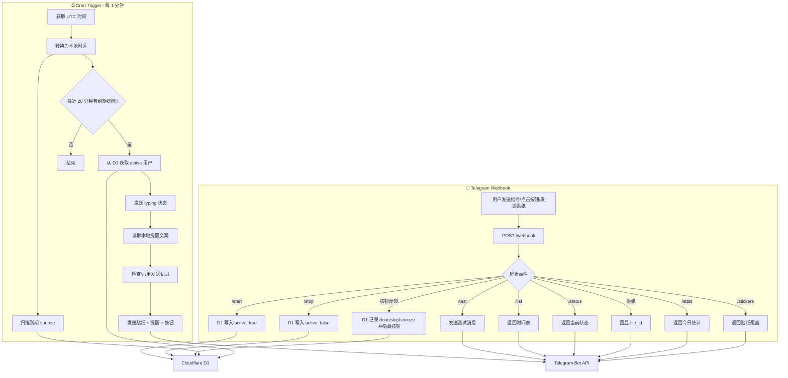

# Reminder Bot

基于 Cloudflare Worker 的 Telegram 每日定时提醒机器人。通过 Cron Trigger 定时检查，在预设的时间点向所有已激活用户发送提醒消息。

👉 **立即体验：** [@aouos_reminder_bot](https://t.me/aouos_reminder_bot)

## 功能

- ⏰ 每日固定时间自动发送提醒（默认 26 个时间点，覆盖 7:30-22:30）
- 🤖 Telegram Bot 指令控制
- 👥 支持多用户，各自独立管理提醒开关
- 💾 使用 Cloudflare D1 存储用户状态、反馈、连续完成天数和贴纸映射
- 🧩 每条提醒支持「完成 / 跳过 / 10 分钟后」按钮，点击后自动隐藏按钮
- 🖼️ 支持 typing 状态和场景贴纸：提醒发送时先发贴纸，再发送本地配置的 Anya 风格提醒文案
- 📊 支持命令查看今日统计和贴纸场景
- 📨 定时器会记录已发送的提醒，避免 Cloudflare Cron 延迟几分钟导致漏发或重复发

### Bot 指令

| 指令 | 说明 |
|------|------|
| `/start` | 开启每日提醒 |
| `/stop` | 关闭每日提醒 |
| `/test` | 发送测试消息，按钮不写入统计；测试延后为 10 秒 |
| `/list` | 查看今日提醒时间表及完成进度 |
| `/status` | 查看当前提醒状态 |
| `/stats` | 查看今日完成、跳过、延后统计 |
| `/stickers` | 查看贴纸场景覆盖情况 |

### 默认时间线

```
07:30  ⏰ 起床
07:45  🚶 晨间散步（30 分钟）
08:15  🍳 早餐 + 颈部拉伸
09:00  📚 上午工作学习开始
09:30 - 11:30  🧘💧 每 30 分钟活动/喝水提醒交替
12:00  🍱 午餐
12:30  🚶 餐后走动
13:00  😴 午休（不超过 30 分钟）
14:00  📚 下午工作学习开始
14:30 - 17:30  🧘💧 每 30 分钟活动/喝水提醒交替
18:00  🍽️ 晚餐
18:30  🚶 饭后散步
19:30  📖 放松时间
21:30  📵 屏幕宵禁 + 睡前放松流程
22:30  🛏️ 上床睡觉
```

## 快速开始

### 1. 创建 Telegram Bot

1. 在 Telegram 中找到 [@BotFather](https://t.me/BotFather)
2. 发送 `/newbot`，按提示创建
3. 记录返回的 Bot Token

### 2. 安装依赖

```bash
npm install
```

### 3. 创建 D1 数据库

```bash
npx wrangler d1 create reminder-bot-db
```

将返回的 `database_id` 填入 `wrangler.toml`：

```toml
[[d1_databases]]
binding = "DB"
database_name = "reminder-bot-db"
database_id = "你的 D1 database_id"
migrations_dir = "migrations"
```

应用数据库结构：

```bash
npx wrangler d1 migrations apply DB --remote
```

### 4. 配置 Bot Token

```bash
npx wrangler secret put TG_BOT_TOKEN
# 输入你的 Telegram Bot Token
```

### 5. 部署

```bash
npm run deploy
```

### 6. 注册 Webhook

部署成功后，在浏览器中访问：

```
https://your-worker.your-subdomain.workers.dev/setup
```

看到 setup 页面里 Webhook、指令菜单和菜单按钮恢复都显示成功即为完成。

### 7. 开始使用

在 Telegram 中向你的 Bot 发送 `/start`，即可激活每日提醒。

> 如果你之前用 KV 版本部署过，切到 D1 后需要用户重新发送一次 `/start`，让 bot 在 D1 里创建 chat 记录。

## 自定义

### 修改提醒时间和内容

编辑 `src/timeline.ts`：

```ts
export const timeline: TimelineItem[] = [
  { hour: 7, minute: 30, message: "⏰ <b>起床啦！</b>\n\nbolt特工，不可以赖床刷手机！阿尼亚发现太阳光任务，快拉开窗帘，哇酷哇酷！✨" },
  // ...添加、删除或修改时间点
];
```

消息支持 HTML 格式（`<b>`、`<i>`、`<code>` 等），使用 `\n` 换行。

> **注意：** 默认 Cron 每 1 分钟执行一次（`* * * * *`）。代码会扫描最近 20 分钟内到期且未发送的提醒，抵消 Cron 轻微延迟；发送成功后会写入 D1，避免重复发送。

### 配置贴纸

把贴纸发送给 bot，bot 会自动写入 `sticker_assets`，然后回复一组场景按钮。点击场景按钮后，bot 会把这个贴纸映射到 `sticker_mappings`。

支持的场景包括：`wake`、`water`、`move`、`meal`、`sleep`、`focus`、`default`。同一个场景可以映射多个贴纸，发送时会按 `weight` 随机选一个；默认按钮创建的映射权重是 `1`。

### 修改时区

在 `wrangler.toml` 中修改 `TIMEZONE`：

```toml
[vars]
TIMEZONE = "Asia/Shanghai"  # 改为你的时区
```

## 本地开发

```bash
npm run dev
```

需要在项目根目录创建 `.dev.vars` 文件配置本地环境变量：

```
TG_BOT_TOKEN=你的Bot Token
```

本地 D1 可以先应用 migration：

```bash
npx wrangler d1 migrations apply DB --local
```

## 工作原理



## License

MIT
