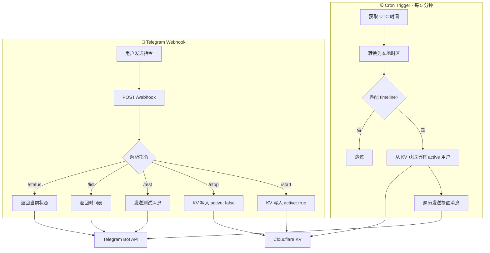

# Reminder Bot

基于 Cloudflare Worker 的 Telegram 每日定时提醒机器人。通过 Cron Trigger 定时检查，在预设的时间点向所有已激活用户发送提醒消息。

## 功能

- ⏰ 每日固定时间自动发送提醒（默认 25 个时间点，覆盖 7:30-22:30）
- 🤖 Telegram Bot 指令控制
- 👥 支持多用户，各自独立管理提醒开关
- 💾 使用 Cloudflare KV 存储用户状态

### Bot 指令

| 指令 | 说明 |
|------|------|
| `/start` | 开启每日提醒 |
| `/stop` | 关闭每日提醒 |
| `/test` | 发送测试消息，确认 Bot 工作正常 |
| `/list` | 查看今日提醒时间表及完成进度 |
| `/status` | 查看当前提醒状态 |

### 默认时间线

```
07:30  ⏰ 起床
07:45  🚶 晨间散步（30 分钟）
08:15  🍳 早餐 + 颈部拉伸
09:00  📚 上午工作学习开始
09:30 - 11:30  🧘💧 每 30 分钟活动/喝水提醒交替
12:00  🍱 午餐
12:30  🚶 餐后走动
13:00  😴 午休（不超过 30 分钟）
14:00  📚 下午工作学习开始
14:30 - 17:30  🧘💧 每 30 分钟活动/喝水提醒交替
18:00  🍽️ 晚餐
18:30  🚶 饭后散步
19:30  📖 放松时间
21:30  📵 屏幕宵禁 + 睡前放松流程
22:30  🛏️ 上床睡觉
```

## 快速开始

### 1. 创建 Telegram Bot

1. 在 Telegram 中找到 [@BotFather](https://t.me/BotFather)
2. 发送 `/newbot`，按提示创建
3. 记录返回的 Bot Token

### 2. 安装依赖

```bash
npm install
```

### 3. 创建 KV Namespace

```bash
npx wrangler kv namespace create REMINDER_KV
```

将返回的 `id` 填入 `wrangler.toml`：

```toml
[[kv_namespaces]]
binding = "REMINDER_KV"
id = "你的 KV Namespace ID"
```

### 4. 配置 Bot Token

```bash
npx wrangler secret put TG_BOT_TOKEN
# 输入你的 Telegram Bot Token
```

### 5. 部署

```bash
npm run deploy
```

### 6. 注册 Webhook

部署成功后，在浏览器中访问：

```
https://your-worker.your-subdomain.workers.dev/setup
```

看到以下 JSON 响应即为成功：

```json
{
  "webhook": "✅ set",
  "commands": "✅ set",
  "webhookUrl": "https://your-worker.your-subdomain.workers.dev/webhook"
}
```

### 7. 开始使用

在 Telegram 中向你的 Bot 发送 `/start`，即可激活每日提醒。

## 自定义

### 修改提醒时间和内容

编辑 `src/timeline.ts`：

```ts
export const timeline: TimelineItem[] = [
  { hour: 7, minute: 30, message: "⏰ <b>起床！</b>\n\n· 不要赖床刷手机\n· 拉开窗帘让光线进来 🌞" },
  // ...添加、删除或修改时间点
];
```

消息支持 HTML 格式（`<b>`、`<i>`、`<code>` 等），使用 `\n` 换行。

> **注意：** 默认 Cron 每 5 分钟执行一次（`*/5 * * * *`）。如果添加了不是 5 倍数分钟的时间点，需要在 `wrangler.toml` 中将 cron 改为 `* * * * *`。

### 修改时区

在 `wrangler.toml` 中修改 `TIMEZONE`：

```toml
[vars]
TIMEZONE = "Asia/Shanghai"  # 改为你的时区
```

## 本地开发

```bash
npm run dev
```

需要在项目根目录创建 `.dev.vars` 文件配置本地环境变量：

```
TG_BOT_TOKEN=你的Bot Token
```

## 工作原理



## License

MIT

